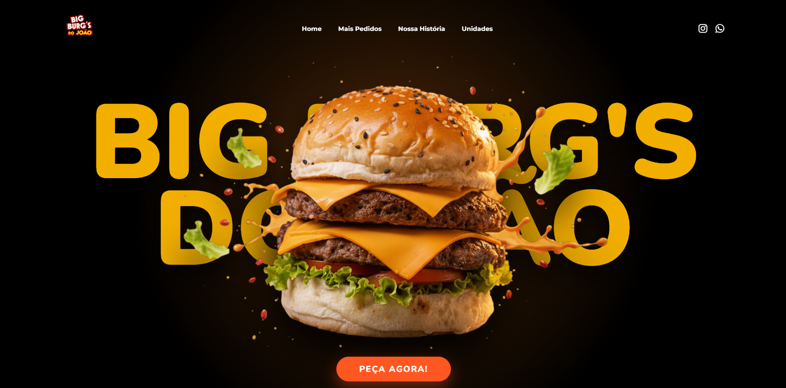

# 🍔 Big Burg's do João - Landing Page

## 🚀 Sobre o Projeto
Este projeto foi desenvolvido para a hamburgueria **Big Burg's do João**,  focada em experiência do usuário (UX) e impacto visual.O foco principal foi criar uma percepção de profundidade e dinamismo através de animações nativas.

## 🛠️ Tecnologias Utilizadas
* **HTML5 Semântico:** Estruturação focada em SEO.
* **CSS3:** Uso de variáveis para fácil manutenção de temas e cores.
* **JavaScript:** Implementação de lógica de animação sem dependências externas.
* **Whisk:** Manipulação de imagens fornecidas pela hamburgueria.
* **Google Fonts:** Integração das fontes Montserrat, Oswald e Nunito para hierarquia tipográfica.

## ✨ Diferenciais Técnicos
* **Hero Section 3D:** Composição de camadas com efeitos de iluminação e profundidade via CSS.
* **Parallax Dinâmico:** Efeito de profundidade nos ingredientes e produtos durante o scroll.
* **Scroll Reveal:** Sistema de revelação de conteúdo.
* **Design Responsivo:** Layout totalmente adaptável para dispositivos móveis e desktops.

## 📖 Como Visualizar
Você pode visualizar o projeto em execução através do link abaixo:
> **[Link do Site do Big Burg's do João!](https://bigburgsdojoao.netlify.app/)**

## 👨‍💻 Desenvolvedor
Desenvolvido por **Davi Linhares**.

* **LinkedIn:** [linharessdavi](https://www.linkedin.com/in/linharessdavi/)
* **Instagram:** [@linharessdavi](https://instagram.com/linharessdavi)
* **GitHub:** [DaviLinharess](https://github.com/DaviLinharess)
